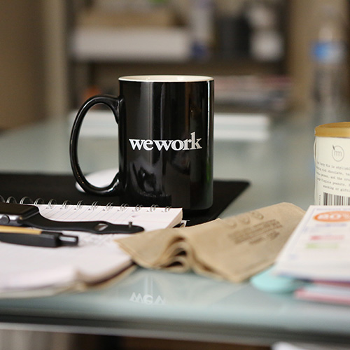

# 卡片

## 展示效果组1

<div style="background:#f5f5f5;padding:20px"><div class="card"><div class="card-bd"><span class="text-muted small"><span class="tag is-primary font-600 mr-1">信息</span>35分钟之前</span><h4 class="my-20">今天是个好天气哟~</h4><p>这是一条普通的卡片文字信息……Two roads diverged in a wood,and I took the one lesstraveled by,And that has made all the difference.</p><a class="d-inline-block font-weight-semi-bold"href="#"><span>Read More</span><i class="icon icon-jiantou"></i></a></div><div class="card-ft flex-y-c bo-top"><div class="d-flex flex-y-c">Jim</div><div class="ml-auto"><i class="icon text-muted icon-comment-m"></i><span>48</span></div><div class="ml-3"><i class="icon text-muted icon-like-m"></i><span>55</span></div></div></div></div>

```html
<!-- 效果1 -->
<div class="card">
    <div class="card-bd">
        <h6 class="text-muted small">
            <span class="tag is-primary font-600 mr-1">信息</span> 35分钟之前
        </h6>
        <h4 class="my-20">今天是个好天气哟~</h4>
        <p>这是一条普通的卡片文字信息……</p>
        <a class="d-inline-block font-weight-semi-bold" href="#">
            <span>Read More</span><i class="icon icon-jiantou"></i>
        </a>
    </div>
    <div class="card-ft flex-y-c bo-top">
        <div class="d-flex flex-y-c">
            Jim
        </div>
        <div class="ml-auto">
            <i class="icon text-muted icon-comment-m"></i><span>48</span>
        </div>
        <div class="ml-3">
            <i class="icon text-muted icon-like-m"></i><span>55</span>
        </div>
    </div>
</div>
```
<div style="background:#f5f5f5;padding:20px"><div class="card"><div class="card-bd bg-primary text-white"><span class="small"><span class="tag is-primary font-600 mr-1">信息</span>35分钟之前</span><h4 class="my-20">今天是个好天气哟~</h4><p>这是一条普通的卡片文字信息……Two roads diverged in a wood,and I took the one lesstraveled by,And that has made all the difference.</p><a class="d-inline-block link-white"href="#"><span>Read More</span><i class="icon icon-jiantou"></i></a></div><div class="card-ft flex-y-c"><div class="d-flex flex-y-c">Jim</div><div class="ml-auto"><i class="icon text-muted icon-comment-m"></i><span>48</span></div><div class="ml-3"><i class="icon text-muted icon-like-m"></i><span>55</span></div></div></div></div>

```html
<!-- 效果2 -->
<div class="card">
	<div class="card-bd bg-primary text-white">
        <span class="small"><span class="tag is-primary font-600 mr-1">信息</span>35分钟之前</span>
		<h4 class="my-20">今天是个好天气哟~</h4>
		<p>这是一条普通的卡片文字信息……</p><a class="d-inline-block link-white" href="#"><span>Read More</span><i class="icon icon-jiantou"></i></a>
	</div>
	<div class="card-ft flex-y-c">
		<div class="d-flex flex-y-c">
			Jim</div>
			<div class="ml-auto"><i class="icon text-muted icon-comment-m"></i><span>48</span>
		</div>
		<div class="ml-3"><i class="icon text-muted icon-like-m"></i><span>55</span>
		</div>
	</div>
</div>
```
<div style="background:#f5f5f5;padding:20px"><div class="card bg-mask text-white ov-hidden"style="background: url(assets/images/img3.jpg)"><div class="card-hd pb-2"><span class="small"><span class="tag is-primary font-600 mr-1">信息</span>35分钟之前</span></div><div class="card-bd pt-0"><h4 class="mb-2">今天是个好天气哟~</h4><p>这是一条普通的卡片文字信息……Two roads diverged in a wood,and I took the one lesstraveled by,And that has made all the difference.</p><a class="d-inline-block link-white"href="#"><span>Read More</span><i class="icon icon-jiantou"></i></a></div><div class="card-ft flex-y-c"><div class="d-flex flex-y-c">Jim</div><div class="ml-auto"><i class="icon icon-comment-m"></i><span>48</span></div><div class="ml-3"><i class="icon icon-like-m"></i><span>55</span></div></div></div></div>

```html
<!-- 效果3 -->
<div class="card bg-mask text-white ov-hidden" style="background: url(assets/images/img3.jpg)">
	<div class="card-hd pb-2">
		<span class="small"><span class="tag is-primary font-600 mr-1">信息</span>35分钟之前</span>
	</div>
	<div class="card-bd pt-0">
		<h4 class="mb-2">今天是个好天气哟~</h4>
		<p>这是一条普通的卡片文字信息……</p>
		<a class="d-inline-block link-white" href="#"><span>Read More</span><i class="icon icon-jiantou"></i></a>
	</div>
	<div class="card-ft flex-y-c">
		<div class="d-flex flex-y-c">
			Jim</div>
		<div class="ml-auto">
			<i class="icon icon-comment-m"></i><span>48</span>
		</div>
		<div class="ml-3">
			<i class="icon icon-like-m"></i><span>55</span>
		</div>
	</div>
</div>
```

## 展示效果组2

<div class="mb-2 row"><div class="col-4"><div class="card bo"><div class="card-hd p-0 ov-hidden"></div><div class="card-bd"><span class="text-muted small"><span class="tag is-primary font-600 mr-1">信息</span>35分钟之前</span><h4 class="my-20">今天是个好天气哟~</h4><p>Two roads diverged in a wood,and I took the one lesstraveled by,And that has made all the difference.</p><a class="d-inline-block font-weight-semi-bold"href="#"><span>Read More</span><i class="icon icon-jiantou"></i></a></div><div class="card-ft flex-y-c bo-top"><div class="d-flex flex-y-c">Jim</div><div class="ml-auto"><i class="icon text-muted icon-comment-m"></i><span>48</span></div><div class="ml-3"><i class="icon text-muted icon-like-m"></i><span>55</span></div></div></div></div><div class="col-4"><div class="card hover-shadow-sm"><div class="card-hd p-0 ov-hidden"></div><div class="card-bd bg-primary text-white"><span class="small"><span class="tag is-white font-600 mr-1">信息</span>35分钟之前</span><h4 class="my-20">今天是个好天气哟~</h4><p>Two roads diverged in a wood,and I took the one lesstraveled by,And that has made all the difference.</p><a class="d-inline-block link-white"href="#"><span>Read More</span><i class="icon icon-jiantou"></i></a></div><div class="card-ft flex-y-c bo"><div class="d-flex flex-y-c">Jim</div><div class="ml-auto"><i class="icon text-muted icon-comment-m"></i><span>48</span></div><div class="ml-3"><i class="icon text-muted icon-like-m"></i><span>55</span></div></div></div></div><div class="col-4"><div class="card bo"><div class="card-hd p-0 ov-hidden"></div><div class="card-bd"><span class="text-muted small"><span class="tag is-secondary font-600 mr-1">信息</span>35分钟之前</span><h4 class="my-20">今天是个好天气哟~</h4><p>Two roads diverged in a wood,and I took the one lesstraveled by,And that has made all the difference.</p><a class="d-inline-block"href="#"><span>Read More</span><i class="icon icon-jiantou"></i></a></div><div class="card-ft flex-y-c"><div class="d-flex flex-y-c">Jim</div><div class="ml-auto"><i class="icon icon-comment-m"></i><span>48</span></div><div class="ml-3"><i class="icon icon-like-m"></i><span>55</span></div></div></div></div></div>

```html
<div class="card bo">
    <div class="card-hd p-0 ov-hidden">
        
    </div>
    <div class="card-bd">
        <span class="text-muted small">
            <span class="tag is-primary font-600 mr-1">信息</span>35分钟之前
        </span>
        <h4 class="my-20">今天是个好天气哟~</h4>
        <p>这是一条普通的卡片文字信息……</p>
        <a class="d-inline-block font-weight-semi-bold" href="#">
            <span>Read More</span><i class="icon icon-jiantou"></i>
        </a>
    </div>
    <div class="card-ft flex-y-c bo-top">
        <div class="d-flex flex-y-c">
            Jim
        </div>
        <div class="ml-auto">
            <i class="icon text-muted icon-comment-m"></i><span>48</span>
        </div>
        <div class="ml-3">
            <i class="icon text-muted icon-like-m"></i><span>55</span>
        </div>
    </div>
</div>
```

## 展示效果组3

<div style="background:#f5f5f5;padding:20px"><div class="item row"><div class="col-6"><div class="card"><div class="card-hd py-2 flex-y-c"><h4 class="mb-0">Posts</h4><div class="card-tool ml-auto dropdown"><a class="link-muted arrow arrow-a"href=""class="nav-link">编辑</a><ul class="drop-menu"><li class="menu-item"><a href=""class="menu-link">编辑</a></li><li class="menu-item"><a href=""class="menu-link">删除</a></li><li class="menu-item"><a href=""class="menu-link">分享</a></li></ul></div></div><ul class="card-bd pt-0"><li class="media flex-y-c bo-top py-3"><div class="media-bd"><h3 class="mb-10"><a href=""class="link-dark font-15px">去年9月到今年4月，我记录下了旅途中的这些小惊喜</a></h3><div class="d-flex small text-muted"><span>35分钟之前</span><span class="d-flex align-items-center ml-3"><i class="icon icon-comment-m"></i><span>48</span></span><span class="d-flex align-items-center ml-3"><i class="icon icon-like-m"></i><span>55</span></span></div></div></li><li class="media flex-y-c bo-top py-3"><div class="media-bd"><h3 class="mb-10"><a href=""class="link-dark font-15px">去年9月到今年4月，我记录下了旅途中的这些小惊喜</a></h3><div class="d-flex small text-muted"><span>35分钟之前</span><span class="d-flex align-items-center ml-3"><i class="icon icon-comment-m"></i><span>48</span></span><span class="d-flex align-items-center ml-3"><i class="icon icon-like-m"></i><span>55</span></span></div></div></li><li class="media flex-y-c bo-top py-3"><div class="media-bd"><h3 class="mb-10"><a href=""class="link-dark font-15px">去年9月到今年4月，我记录下了旅途中的这些小惊喜</a></h3><div class="d-flex small text-muted"><span>35分钟之前</span><span class="d-flex align-items-center ml-3"><i class="icon icon-comment-m"></i><span>48</span></span><span class="d-flex align-items-center ml-3"><i class="icon icon-like-m"></i><span>55</span></span></div></div></li></ul></div></div><div class="col-6"><div class="card"><div class="card-hd"><h4 class="mb-0">Posts</h4></div><ul class="card-bd pt-0"><li class="media flex-y-c bo-top py-3"><div class="media-bd"><h3 class="mb-10"><a href=""class="link-dark font-15px">去年9月到今年4月，我记录下了旅途中...</a></h3><div class="d-flex small text-muted"><span>35分钟之前</span><span class="d-flex align-items-center ml-3"><i class="icon icon-comment-m"></i><span>48</span></span></div></div></li><li class="media flex-y-c bo-top py-3"><div class="media-bd"><h3 class="mb-10"><a href=""class="link-dark font-15px">去年9月到今年4月，我记录下了旅途中...</a></h3><div class="d-flex small text-muted"><span>35分钟之前</span><span class="d-flex align-items-center ml-3"><i class="icon icon-comment-m"></i><span>48</span></span></div></div></li><li class="media flex-y-c bo-top py-3"><div class="media-bd"><h3 class="mb-10"><a href=""class="link-dark font-15px">去年9月到今年4月，我记录下了旅途中...</a></h3><div class="d-flex small text-muted"><span>35分钟之前</span><span class="d-flex align-items-center ml-3"><i class="icon icon-comment-m"></i><span>48</span></span></div></div></li></ul></div></div></div></div>


```html
<div class="card">
    <div class="card-hd py-2 flex-y-c">
        <h4 class="mb-0">Posts</h4>
        <div class="card-tool ml-auto dropdown">
            <a class="link-muted arrow arrow-a" href="" class="nav-link">编辑</a>
            <ul class="drop-menu">
                <li class="menu-item"><a href="" class="menu-link">编辑</a></li>
                <li class="menu-item"><a href="" class="menu-link">删除</a></li>
            </ul>
        </div>
    </div>
    <ul class="card-bd pt-0">
        <li class="media flex-y-c bo-top py-3">
            
            <div class="media-bd">
                <h3 class="mb-10">
                    <a href="" class="link-dark font-15px">去年9月到今年4月，我记录下了...</a>
                </h3>
                <div class="d-flex small text-muted">
                    <span>35分钟之前</span>
                    <span class="d-flex align-items-center ml-3">
                        <i class="icon icon-comment-m"></i><span>48</span>
                    </span>
                    <span class="d-flex align-items-center ml-3">
                        <i class="icon icon-like-m"></i><span>55</span>
                    </span>
                </div>
            </div>
        </li>
    </ul>
</div>
```


