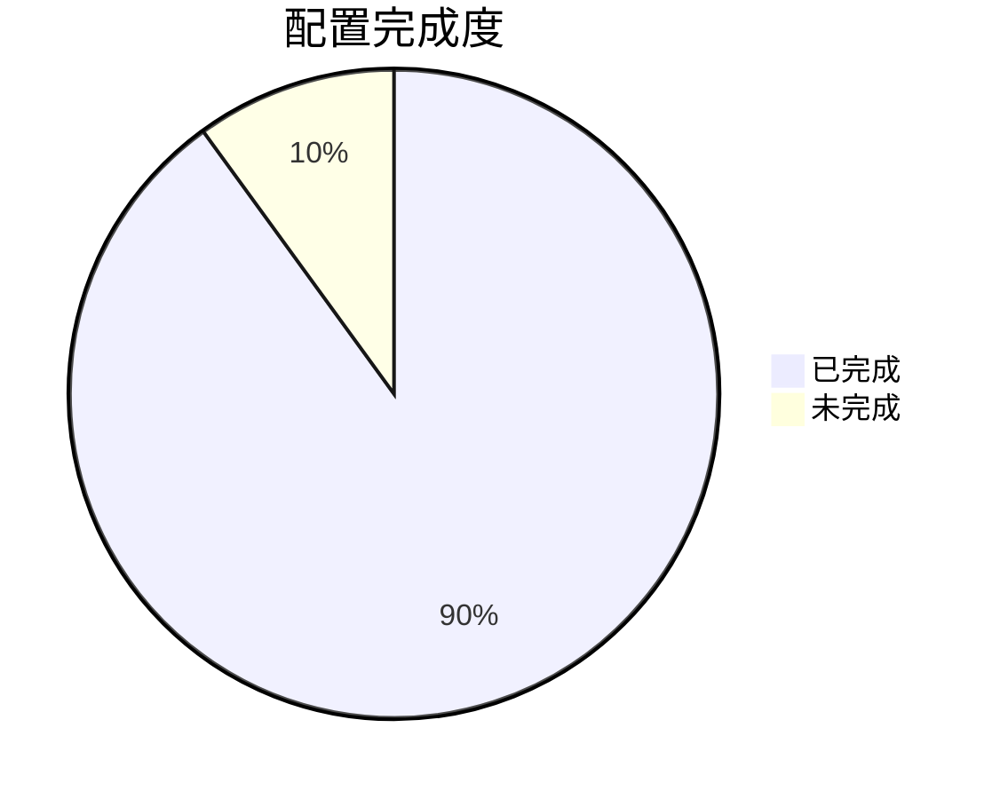
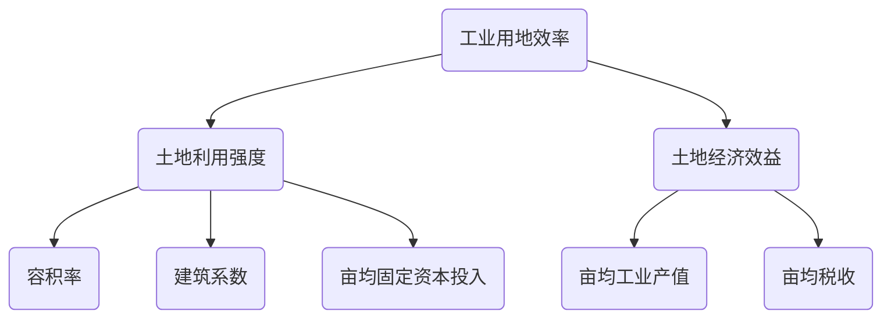

# docsify配置

## 自定义markdown(code)语法

> 我们在写技术文档很多时候需要插入一大堆html演示示例的代码，而每处代码都有相同的html结构，这时候我们就可以通过配置markdown的`renderer`来实现输入特定的语句自动编译成html代码。

1、我们在docsify中进行配置markdown的code：

```js
window.$docsify = {
    // markdown配置
    markdown: {
        renderer: {
            code: function(code, lang) {
                // 让markdown支持自定义的代码块code解析
                if (lang === "demo") {
                    return (
                        '<div class="demo-box border p-3">' + code + "</div>"
                    );
                }
                return this.origin.code.apply(this, arguments);
            }
        }
    },
};
```

2、我们在markdown中书写的语法：

````md
```demo
您的内容...
```
````

3、解析出来的html结构是：

```demo
您的内容...
```

```html
<div class="demo-box border p-3">您的内容...</div>
```


## flexible-alerts插件

- [插件地址](https://github.com/fzankl/docsify-plugin-flexible-alerts)

**效果：**

> [!NOTE]
> An alert of type 'note' using global style 'callout'.

> [!TIP]
> An alert of type 'tip' using global style 'callout'.

> [!WARNING]
> An alert of type 'warning' using global style 'callout'.

> [!DANGER]
> An alert of type 'danger' using global style 'callout'.

> [!HELLO]
> 这是自定义的标签效果.

**语法：**

```md
> [!NOTE]
> An alert of type 'note' using global style 'callout'.

> [!TIP]
> An alert of type 'tip' using global style 'callout'.

> [!WARNING]
> An alert of type 'warning' using global style 'callout'.

> [!DANGER]
> An alert of type 'danger' using global style 'callout'.
```

**配置方法：**

1、引入js

```html
<!-- flexible-alerts -->
<script src="//cdn.jsdelivr.net/npm/docsify-plugin-flexible-alerts"></script>
```

2、配置docsify中展示的样式

```js
window.$docsify = {
    'flexible-alerts': {
        style: 'flat',
        note: {
            label: "注意"
        },
        tip: {
            label: "提示"
        },
        warning: {
            label: "警告"
        },
        danger: {
            label: "错误"
        },
        // 可以添加更多自定义标签
        hello:{
            label:'hello',
            icon: "fas fa-comment",
            className: "hello"
        }
    }
};
```

## docsify-tabs插件

- [插件地址](https://github.com/jhildenbiddle/docsify-tabs)

**效果：**

<!-- tabs:start -->

### **Title1**

Hello!

### **Title2**

Bonjour!

### **Title3**

Ciao!

<!-- tabs:end -->

**语法：**

```markdown

<!-- tabs:start -->

### **Title1**

Hello!

### **Title2**

Bonjour!

### **Title3**

Ciao!

<!-- tabs:end -->
```

**配置：**

```html
<!-- docsify-tabs 插件 -->
<script src="https://cdn.jsdelivr.net/npm/docsify-tabs"></script>
```

```js
window.$docsify = {
    // docsify-tabs插件
    tabs: {
        // persist    : false,
        // sync       : false,
        // theme      : 'material',	// 下划线风格
        // tabComments: false,
        // tabHeadings: false
    },
};
```

```css
/* 美化默认样式 */
.docsify-tabs--classic .docsify-tabs__tab--active{box-shadow: none;}
```

## 支持mermaid脑图插件

- [插件地址](https://mermaid-js.github.io/mermaid/)

**效果：**





**配置:**

1、引入插件js(需在以下配置之前引入)

```html
<!-- markdown支持mermaid脑图插件 -->
<!-- <link rel="stylesheet" href="//cdn.jsdelivr.net/npm/mermaid/dist/mermaid.min.css"> -->
<script src="//cdn.jsdelivr.net/npm/mermaid/dist/mermaid.min.js"></script>
```

2、配置插件样式

```js
// markdown支持mermaid脑图插件
var num = 0;
const conf = {
    logLevel:4,
    startOnLoad: false,
    themeCSS:'.label { font-family: Source Sans Pro,Helvetica Neue,Arial,sans-serif; } .node rect{fill:#fff;stroke: #999;} .edgePath .path{stroke:#999;stroke-width:1px}'
};
mermaid.initialize(conf);
```

3、配置docsify

```js
window.$docsify = {
    // markdown支持mermaid脑图插件
    markdown: {
        renderer: {
            code: function(code, lang) {
                if (lang === "mermaid") {
                    return (
                    '<div class="mermaid">' + mermaid.render('mermaid-svg-' + num++, code) + "</div>"
                    );
                }
                return this.origin.code.apply(this, arguments);
            }
        }
    },
}
```

## 侧边栏折叠插件

详情访问[github项目](https://github.com/iPeng6/docsify-sidebar-collapse)

## 右侧目录树

```css
/* 右侧目录树 */
@media (min-width: 992px) {
    .content{right:220px}

    .sidebar-nav li > .app-sub-sidebar {
        width: 220px;
        position: fixed;
        top: 130px;
        bottom:0;
        left:calc((100% - 300px) * 80%);
        right:0;
        background: #fff;
        overflow-y: auto;
        /* overflow: visible; */
    }
    .sidebar-nav li > .app-sub-sidebar::before{
        display: block;
        content: '本文目录';
        font-weight: bold;
    }
    .sidebar-nav li > .app-sub-sidebar li{
        display: flex;
        align-items: center;
        width: 100%;
        position: relative;
    }
    .section-link{flex-grow: 1}
    .sidebar-nav li > .app-sub-sidebar > li::before{
        content:'';
        display: block;
        width: 11px;
        height: 11px;
        border:2px solid #fff;
        border-radius: 50%;
        background-color:#ddd;
        position: absolute;
        left:0;
        z-index: 1;
    }
    .app-sub-sidebar > li::after{
        position: absolute;
        top:0;
        left: 5px;
        content:'';
        display: block;
        width: 1px;
        height: 100%;
        background-color:#ededed;
    }
    .sidebar-nav li > .app-sub-sidebar > .active::before{
        background-color:var(--theme-color,#42b983);
    }
    /* parent-active */
    .sidebar ul li.parent-active>a {
        border-right: 2px solid;
        color: var(--theme-color,#42b983);
        font-weight: 600;
    }
    /* scrollbar */
    .sidebar-nav li > .app-sub-sidebar::-webkit-scrollbar {
        width:4px
    }
    .sidebar-nav li > .app-sub-sidebar::-webkit-scrollbar-thumb {
        background:transparent;
        border-radius:4px
    }
    .sidebar-nav li > .app-sub-sidebar:hover::-webkit-scrollbar-thumb {
        background:hsla(0,0%,53.3%,.4)
    }
    .sidebar-nav li > .app-sub-sidebar:hover::-webkit-scrollbar-track {
        background:hsla(0,0%,53.3%,.1)
    }

    /* hack */
    .sidebar-nav .app-sub-sidebar li.active a{border:0;}
    .app-sub-sidebar{margin: 0!important;}
    .app-sub-sidebar li{margin: 0!important;padding:5px 25px}

}
```

如果文档的目录树特别长，可以考虑给`.app-sub-sidebar`添加`overflow-y:auto`否则在小尺寸的屏幕下可能无法完整的显示所有的目录树。

为了让左侧的上一级菜单同时高亮，我们还需要通过plugins配置一下：让每次路由切换时数据全部加载完成后调用class

```js
plugins: [
    function(hook, vm) {
        // 每次路由切换时数据全部加载完成后调用，没有参数。
        hook.doneEach(function() {
            // 给侧边栏.active添加父级class
            var subNav = document.getElementsByClassName("app-sub-sidebar")[0];
            subNav.parentNode.classList.add("parent-active");
            // subNav.parentNode.className = "parent-active";

        }
    );
}
```

## 更多插件

参考 [awesome-docsify](https://github.com/docsifyjs/awesome-docsify)

## 忽略h2-h6标题

当设置了 `subMaxLevel` 时，默认情况下每个标题都会自动添加到侧边栏目录中。如果你想忽略特定的标题不显示，可以给它添加 `<!-- {docsify-ignore} -->`。

```markdown
# Getting Started

## Header <!-- {docsify-ignore} -->

该标题不会出现在侧边栏的目录中。
```

要忽略特定页面上的所有标题，你可以在页面的第一个标题上使用 `<!-- {docsify-ignore-all} --> `。

```markdown
# Getting Started <!-- {docsify-ignore-all} -->

## Header

该页面所有标题不会出现在侧边栏的目录中。
```

